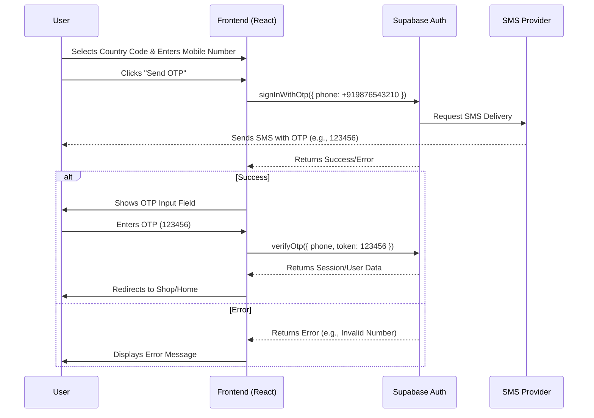

# Mobile OTP Login - Design & Functional Specifications

## 1. Overview
This document outlines the design and implementation details for the **Mobile Number Login with OTP** functionality for the Eassy Bites e-commerce platform. This feature allows users to sign up or log in using their mobile number, providing a passwordless and convenient authentication method.

## 2. Prerequisites
- **Supabase Project**: An active Supabase project.
- **Phone Provider**: A configured SMS provider in Supabase (e.g., Twilio, MessageBird, or the default Supabase testing provider).
- **Frontend**: The existing React + Vite application.

## 3. Functional Requirements
1.  **Input Interface**:
    - A dropdown menu to select the Country Code (e.g., +1, +91, +61).
    - A text input field for the Mobile Number.
2.  **OTP Generation**:
    - A "Send OTP" button that triggers the SMS delivery.
    - Rate limiting handling (graceful error messages if too many requests).
3.  **OTP Validation**:
    - An input field to enter the received 6-digit OTP.
    - A "Verify" button to complete the authentication.
4.  **User Feedback**:
    - Success messages ("OTP Sent", "Login Successful").
    - Error messages ("Invalid OTP", "Network Error").

## 4. Architecture Diagram Flow

## 5. Implementation Details

### Technology Stack
- **Frontend**: React.js
- **Styling**: CSS Modules / Inline Styles (matching existing design)
- **Backend**: Supabase Auth (GoTrue)

### Key Functions
- `handleSendOtp()`: Invokes `supabase.auth.signInWithOtp()`.
- `handleVerifyOtp()`: Invokes `supabase.auth.verifyOtp()`.

### Data Handling
- The mobile number is formatted as `[Country Code][Mobile Number]` (E.164 format) before sending to Supabase.

## 6. Real-World Workflow
1.  **User Arrival**: A user visits the login page and sees tabs for "Email" and "Mobile".
2.  **Selection**: They choose "Mobile".
3.  **Entry**: They select "+61" (Australia) and enter "412345678".
4.  **Action**: They click "Get OTP".
5.  **Wait**: Within seconds, their phone buzzes with a code.
6.  **Verification**: They enter the code on the site.
7.  **Access**: They are instantly logged in without remembering a password.

## 7. Future Scope
- **Resend Timer**: Add a countdown timer (e.g., 30s) before the "Resend OTP" button becomes active.
- **Auto-Fill**: Use the WebOTP API to automatically fill the OTP from the SMS on supported mobile browsers.
- **WhatsApp Integration**: Option to receive OTP via WhatsApp for international users.
- **Multi-Factor Auth (MFA)**: Combine Mobile OTP with a PIN for extra security.
